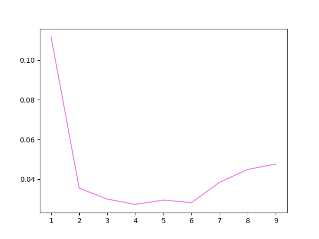
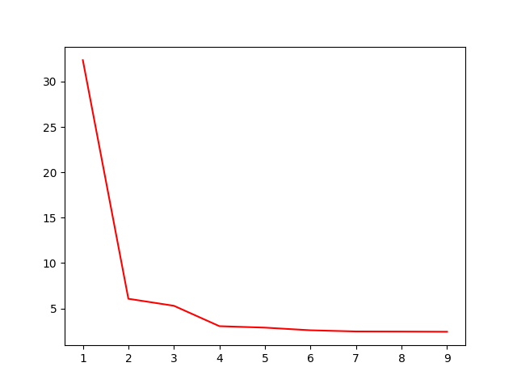
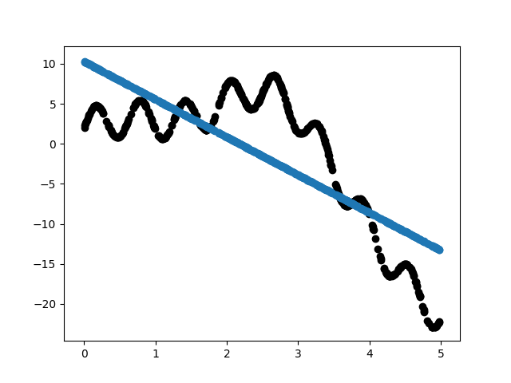
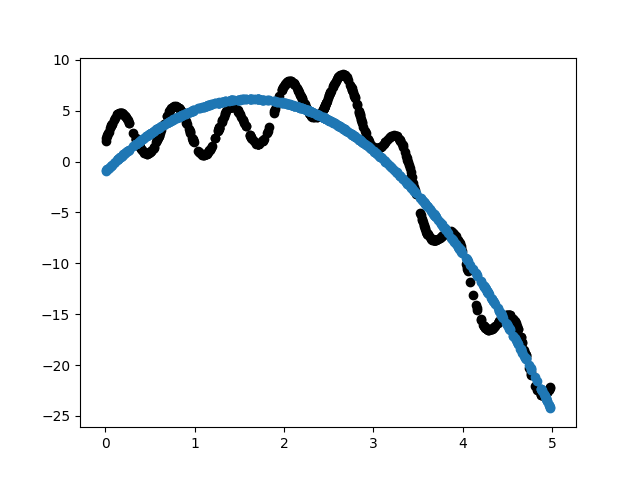
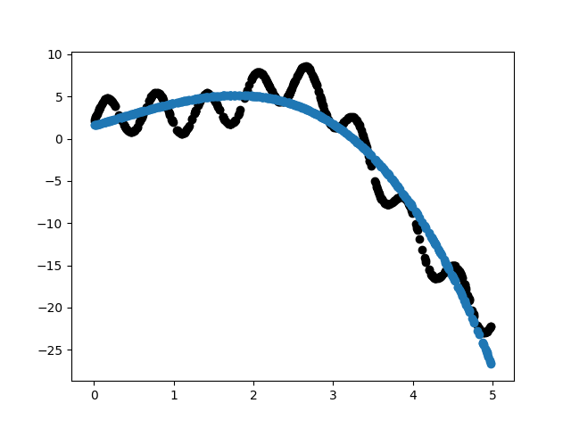
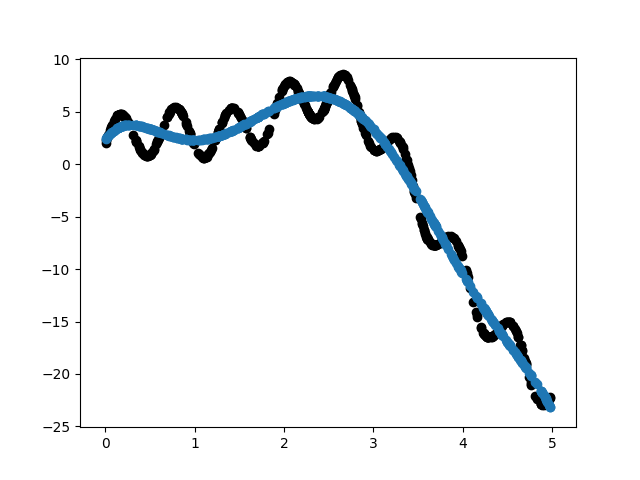
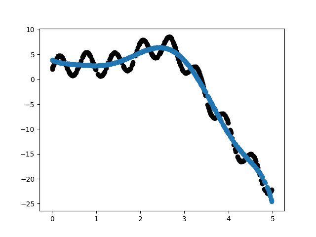

## Results
Polynomial Degree | Bias | Variance
 - | - | -
1  |  30.39071010632431  |  0.08721383486058536
2  |  6.038218817771005  |  0.0525496321071935
3  |  5.332208581768216  |  0.04664377532992744
4  |  3.2289827849180646  |  0.024038069220153068
5  |  3.065191583155287  |  0.03038616413485833
6  |  2.6878522123020696  |  0.03048084260281645
7  |  2.5015968265255646  |  0.03558308688462044
8  |  2.5149015144103335  |  0.03852396737034038
9  |  2.4928993052970334  |  0.041785220559815234

## Variance Plot

## Bias Plot

## Observations
* As we increase the complexity of the model:
    - Variance: The variance decreases to a minima and proceeds to increase.
    - Bias: The Bias decreases steeply at first, then the absolute slope decreases.
* For high complexities, we observe a model with high variance and low bias which is the characteristic of over-fitting.
* For lower complexities, we observe a model with high bias and relatively low variance which is the characteristic of under-fitting. 

## Fit Plots

## Implementation
1. We split the given data into training set and testing set (9:1 ratio) followed by splitting the training set into 10 parts. So we obtain 10 training sets of size 45 and 1 testing set of size 50. 
2. For each degree, we train the model on the 10 training sets seperately.
3. Now for each iteration (for a given degree) of training we store the predicted values of test data in an array, from which the the bias for that iteration is calculated by averaging over all the test data points.
4. Then for each degree, we average the bias^2 for all 10 training sets to result in a mean bias^2.
5. Similarly, using the stored predicted values and the calculated expected values for each point (from calculation of avg bias^2) we average the variance for each training set and thus resulting in variance for a given polynomial degree.
6. Finally for each degree, we average the variance for all 10 training sets to result in a mean variance.
7. To conclude, we plot the graph depicting the variation of bias^2 and variance as the complexity of the model changes.