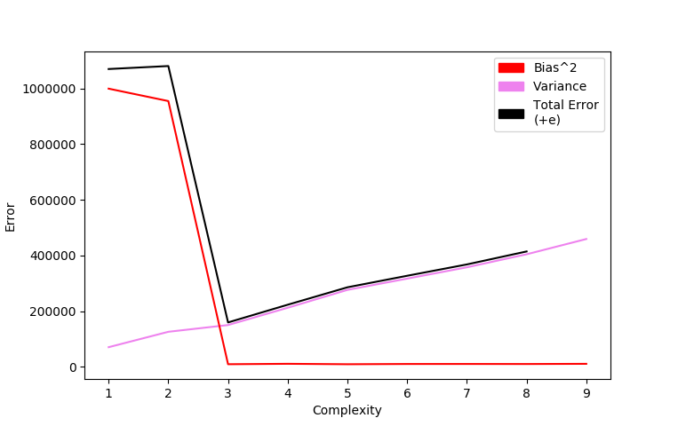
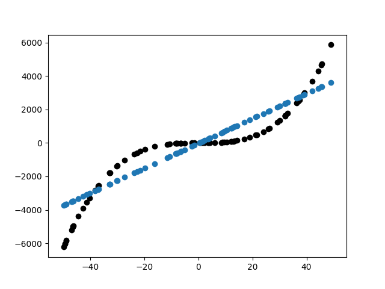
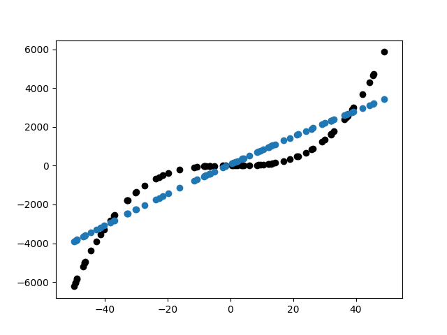
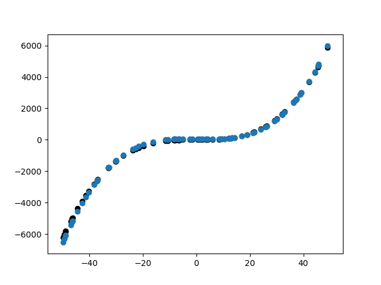
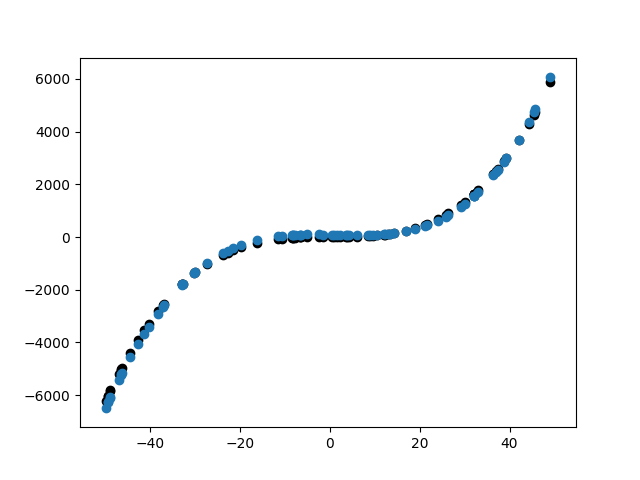
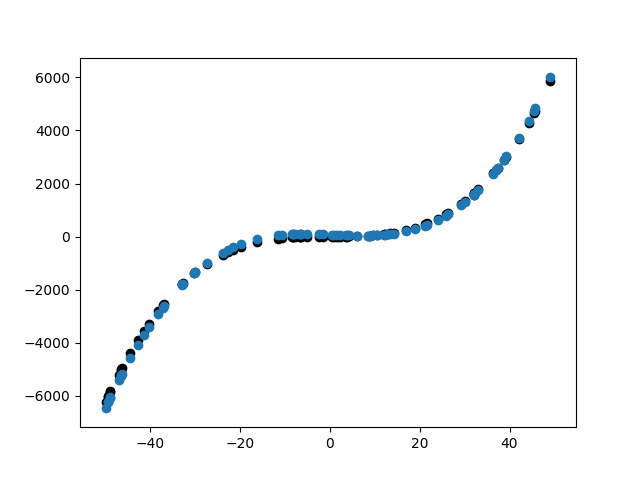
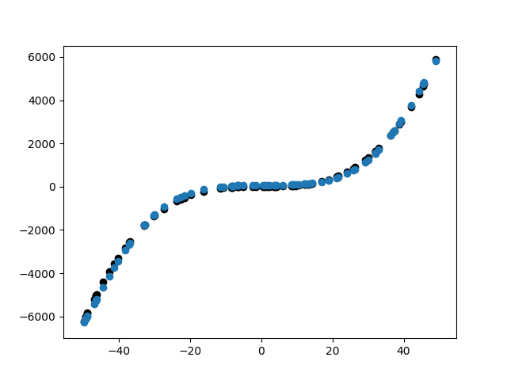
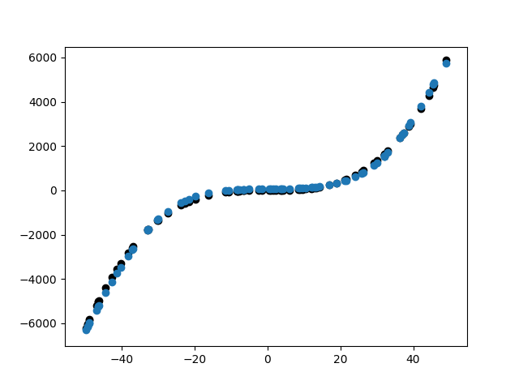
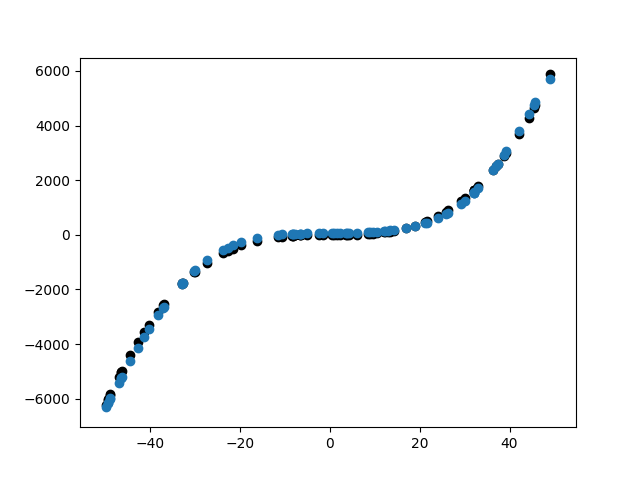

## Results
Polynomial Degree | Bias | Variance
 - | - | -
1  |  999228.3968719237  |  70545.48914575049
2  |  954619.273794425  |  125870.85554877335
3  |  9389.730116791214  |  150073.7395464768
4  |  10907.348134071332  |  212235.70832526154
5  |  9339.194291326017  |  276388.48025474057
6  |  10248.585941147869  |  316863.4984374896
7  |  10335.275861649101  |  357510.98475735483
8  |  10149.419243937262  |  404286.67068578606
9  |  10815.487036574232  |  459132.37837248633

## The Bias Variance Plot

## Observations
From the bias variance plot, we can conclude that:
* For complexity < 3:
    - The graph suggests high bias and low variance which is a characteristic of under-fitting.
    - Under-fitting is when we either have very less amount of data or we are simplifying the model too much.
* For complexity > 3:
    - The graph suggests low bias and high variance which is a characteristic of over-fitting.
    - Over-fitting is when we over complicate the model and when the model captures the noise along with the date.
* For complexity = 3:
    - The graph suggests a model with least value of approximation of the total error, meaning a good balance between bias and variance.
    - A model with such a complexity would be a good fit without compromising on either bias or variance.
    - Ideally an optimum complexity can be determined by mathematical analyisis but it is not always practical.
* The dataset:
    - The underlying pattern in the data seems to be an approximate polynomial in **_x_** with a degree of about 3 because the bias quickly drops at complexity = 3 and stays constant as complexity is further increased.
    - The variance will naturally increase as the complexity of the model is increased as the uncertainity rises along with it.

## Fit Plots

## Implementation
1. For each degree, we train the model on the 20 training sets seperately.
2. Now for each iteration (for a given degree) of training we store the predicted values of test data in an array, from which the the bias for that iteration is calculated by averaging over all the test data points.
3. Then for each degree, we average the bias^2 for all 20 training sets to result in a mean bias^2.
4. Similarly, using the stored predicted values and the calculated expected values for each point (from calculation of avg bias^2) we average the variance for each training set and thus resulting in variance for a given polynomial degree.
5. Finally for each degree, we average the variance for all 20 training sets to result in a mean variance.
6. To conclude, we plot the graph depicting the variation of bias^2 and variance as the complexity of the model changes.